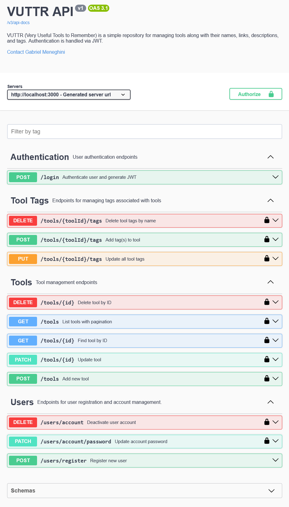

# VUTTR API


Very Useful Tools to Remember (VUTTR) é uma API REST desenvolvida em Java com Spring Boot para gerenciamento de ferramentas.

Foi inspirado no desafio técnico da BossaBox:
https://bossabox.notion.site/Back-end-0b2c45f1a00e4a849eefe3b1d57f23c6

Este projeto foi desenvolvido com foco em boas práticas profissionais, arquitetura em camadas, segurança com JWT (RSA), testes de integração utilizando Testcontainers e testes unitários com JUnit e Mockito.

---

## 📑 Índice

- [🚀 Tecnologias Utilizadas](#-tecnologias-utilizadas)
- [🏗️ Arquitetura](#%EF%B8%8F-arquitetura)
- [🧠 Boas Práticas Aplicadas](#-boas-práticas-aplicadas)
- [⚙️ Pré-requisitos](#%EF%B8%8F-pré-requisitos-para-rodar-o-projeto)
- [▶️ Como Rodar o Projeto](#%EF%B8%8F-como-rodar-o-projeto)
- [🔐 Geração automática das chaves RSA](#-geração-automática-das-chaves-rsa)
- [🧪 Executando os Testes](#-executando-os-testes)
- [🔐 Autenticação](#-autenticação)
- [📘 Documentação da API](#-documentação-da-api)
- [🗃️ Versionamento de Banco](#%EF%B8%8F-versionamento-de-banco)
- [🧩 Perfis de Ambiente](#-perfis-de-ambiente)
- [👨‍💻 Autor](#%E2%80%8D-autor)

---

## 🚀 Tecnologias Utilizadas

- Java 21
- Spring Boot 3.5.6
- Spring Data JPA
- Spring Security
- JWT (RSA)
- PostgreSQL
- Flyway (versionamento de banco)
- Testcontainers
- JUnit 5
- Mockito
- Docker / Docker Compose
- OpenAPI (springdoc)

<div align="right">
   <a href="#-índice">⤴️ Voltar ao índice</a>
</div>

---

## 🏗️ Arquitetura

O projeto segue arquitetura em camadas:

Controller → Service → Repository

Principais características:

- Separação entre entidades e DTOs
- Tratamento global de exceções
- Autenticação e autorização via JWT com chaves RSA
- Versionamento de banco com Flyway
- Testes unitários e de integração
- Configuração por profiles (dev, test, prod)

<div align="right">
   <a href="#-índice">⤴️ Voltar ao índice</a>
</div>

---

## 🧠 Boas Práticas Aplicadas

- Princípios SOLID
- Separação de responsabilidades
- DTO pattern
- Exception Handling global
- Configuração por profiles
- Segurança stateless
- Testes isolados e reproduzíveis

<div align="right">
   <a href="#-índice">⤴️ Voltar ao índice</a>
</div>

---

## ⚙️ Pré-requisitos para rodar o projeto
- Docker
- Java 21+

<div align="right">
   <a href="#-índice">⤴️ Voltar ao índice</a>
</div>

---

## ▶️ Como Rodar o Projeto
### 1️⃣ Clonar o repositório
```bash
git clone https://github.com/GabrielMeneghini/vuttr.git
cd vuttr
```

### 2️⃣ Subir containers com Docker Compose
#### Rodar no perfil Dev
```bash
docker compose --env-file .env.dev.example -f docker-compose.yml -f docker-compose-dev.yml up --build
```
#### Rodar no perfil Prod
```bash
docker compose --env-file .env.prod.example -f docker-compose.yml -f docker-compose-prod.yml up --build
```

### 3️⃣ A aplicação estará disponível em:
```
http://localhost:3000
```

<div align="right">
   <a href="#-índice">⤴️ Voltar ao índice</a>
</div>

---

## 🔐 Geração automática das chaves RSA
Na primeira execução do projeto, as chaves RSA utilizadas na assinatura dos tokens JWT são geradas automaticamente via Docker.
As chaves são criadas na pasta:
```
keys/
```
Se as chaves já existirem, elas serão reutilizadas.

Nenhuma configuração adicional é nessária.

<div align="right">
   <a href="#-índice">⤴️ Voltar ao índice</a>
</div>

---

## 🧪 Executando os Testes
Para rodar todos os testes:
```bash
.\mvnw verify
```
#### - ✅ Testes Unitários
- Utilizam Mockito
- Não dependem de Docker
#### - ✅ Testes de Integração
- Utilizam Testcontainers
- Sobem um container PostgreSQL automaticamente
- Necessitam do Docker em execução

<div align="right">
   <a href="#-índice">⤴️ Voltar ao índice</a>
</div>

---

## 🔐 Autenticação
A API utiliza autenticação baseada em JWT assinado com chaves RSA.

A aplicação segue o modelo stateless, não mantendo sessão no servidor.
Cada requisição protegida deve incluir o token JWT no header Authorization.

Fluxo:

1. Realizar login 
2. Receber token JWT
3. Enviar o token no header:
```
Authorization: Bearer {token}
```

<div align="right">
   <a href="#-índice">⤴️ Voltar ao índice</a>
</div>

---

## 📘 Documentação da API

Após iniciar a aplicação, acesse:

### Swagger UI
```
http://localhost:3000/swagger-ui.html
```
- Swagger está disponível apenas em ambiente de desenvolvimento.



Documentação interativa gerada automaticamente via OpenAPI.

### OpenAPI JSON
A especificação OpenAPI pode ser acessada em:
```
http://localhost:3000/v3/api-docs
```
Esse endpoint contém a descrição completa da API em formato OpenAPI JSON.

<div align="right">
   <a href="#-índice">⤴️ Voltar ao índice</a>
</div>

---

## 🗃️ Versionamento de Banco

O versionamento do banco de dados é feito com Flyway.

Scripts ficam localizados em:

```
src/main/resources/db/migration
```

<div align="right">
   <a href="#-índice">⤴️ Voltar ao índice</a>
</div>

---

## 🧩 Perfis de Ambiente

O projeto possui os seguintes perfis configurados:

- dev
- prod
- test

Testcontainers é utilizado exclusivamente no profile de testes.

<div align="right">
   <a href="#-índice">⤴️ Voltar ao índice</a>
</div>

---

## 👨‍💻 Autor

- Gabriel Meneghini
- LinkedIn: https://www.linkedin.com/in/gabriel-meneghini-717109118/
- GitHub: https://github.com/GabrielMeneghini

<div align="right">
   <a href="#-índice">⤴️ Voltar ao índice</a>
</div>
